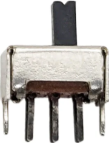

# Noptel LRF rangefinder sampler - 3D-printed case for the Flipper Zero
### Version 1.0

A 3D-printed case for the Flipper Zero speficically designed to house the electronics required to make a universal self-contained power supply and serial interface for Noptel LRF and LRX rangefinders.

This is a companion project for the [Noptel LRF rangefinder sampler app for the Flipper Zero](https://github.com/Giraut/flipper_zero_noptel_lrf_sampler).

Features:

- Powers the rangefinder with two 18650 lithium-ion cells, to take measurements in the field.
- App-controlled power supply: start the app to turn the rangefinder on, quit the app to turn it off.
- Selectable supply voltage: regulated 5V for LRF-series rangefinders or 7.4V (nominal cell voltage) for LRX-series rangefinders.
- Selectable serial voltage level: UART or RS232 (also suitable for rangefinders configured as RS422)
- Screw terminals for ground, supply, Rx and Tx lines to easily connect one or more LRF / LRX cables.

https://github.com/user-attachments/assets/b6e0d0df-ff3f-4f82-9ec8-fc6dd7197d45

* [Files](#files)
* [Printing](#printing)
* [Extra component required](#extra-component-required)
* [Modules modification](#modules-modification)
* [Wiring diagram](#wiring-diagram)
* [Assembly](#assembly)

## Files

[FreeCAD model for all the parts](flipper_case.FCStd)

### Case body

Main case body with standoffs on top to hold the pin header, power control PCB, TTL-to-RS232 converter PCB and TTL-RS232 selection switch, and screw holes to attach the top cover.

- [STEP model for the case body](flipper_case-Flipper_upper_case_with_LRF_electronics.step)

### Case door

Door at the bottom of the main case body to prevent the Flipper Zero for sliding out of the case.

- [STEP model for the case door](flipper_case-Flipper_lower_case_door.step)

### Top cover

Encloses the electronics on top of the main case body and holds the 18650 cell holder, step-down voltage regulator and voltage selection switch.

- [STEP model for the case door](flipper_case-Flipper_case_with_LRF_electronics-Top_cover.step)

## Printing

### Case body

Print the case body with the standoffs (header side) face down on the bed - i.e. with the door opening at the top - and enable support in the slicer.

It makes it harder to remove the supports around the standoffs and the surfaces around the standoffs are rough, but it ensures the interior space for the Flipper Zero is printed without supports, so it's smooth and dimensionally accurate.

The roughness of the supported areas doesn't matter because the top cover ultimately hides them.

Disable support in the 1 mm holes for the hinge, locking pin and optional lanyard pin in the slicer: the holes are small enough that they don't require support, and not having support material inside the holes makes them easier to clean / ream.

After printing, ream the holes with a 1 mm drillbit at very low speed.

### Case door

Print the case door with the bottom of the door face down on the bed.

Disable support in the 1 mm holes for the hinge and locking pin in the slicer: the holes are small enough that they don't require support, and not having support material inside the holes makes them easier to clean / ream.

After printing, ream the holes with a 1 mm drillbit at very low speed.

### Top cover

Print the top cover with the back face down on the bed - i.e. with the Noptel logo at the top - and enable support in the slicer.

When you import the STEP file in the slicer, you will see one body for the top cover proper, and 31 bodies for all the symbols printed around the cover.

If your printer can print with more than one filament, you can print the 31 symbols with a different color so they stand out better.

If your printer can only print with one filament, remove the 31 symbols so the top cover bears the markings as recessed engraved symbols.

Alternatively, if you want to remove one or more markings, print the corresponding symbols with the same material as the top cover, so they fill up the recesses and disappear from the final print.

## Extra components needed

| Qty | Part | Image |
| --- | ---- | ----- |
| 1 | 0.1"-pitch right angle male header |  |
| 1 | YYNMOS-1 MOSFET driver module with optocoupler |  |
| 1 | HW-044 TTL-to-RS232 converter module |  |
| 1 | D-SUN MP1584 step-down converter module |  |
| 1 | UM-18650X2 double 18650 cell holder |  |
| 2 | 17SLDDDPC double pole double throw mini slide switch |  |
| 2 | Pololu #2440 2-pin 5 mm pitch screw terminal block |  |
| 6 | M3 x 10 countersunk screw |  |
| 1 | M3 x 5 screw |  |
| 1 | M2 x 10 set screw |  |
| 1 | M2.5 x 5 socket head or narrow Phillips head screw |  |
| 3  | 30 mm bits of 1 mm piano wire |  |

## Modifications to the modules

### YYNMOS-1 MOSFET driver module

Desolder the screw terminal blocks to reduce the height of the module

### HW-044 TTL-to-RS232 converter module

Desolder the DB9 socket and the pins to reduce the height of the module, then reduce the width of the PCB to 23.30 mm by sawing off the excess PCB where the DB9 socket was.

## Wiring diagram

## Assembly

- Insert the Flipper Zero inside the case and push the pin headers all the way until they sit flush inside the notches on the 3D-printed case.

- Epoxy the headers in place. Make sure the epoxy isn't too runny and doesn't trickle down into the Flipper Zero's header!

- Install the modified YYNMOS-1 module and secure it in place with the M3 x 5 screw. Install the UART-RS232 selection switch and secure it in place with the M2 x 10 set screw across the top.

- Slide the shortened edge of the HW-044 module into the front rail and secure the other side of the PCB to the back standoff with the M2.5 x 5 screw.

- Thread the power supply wires going to the cells holder, the LRF supply wire, ground wire, RX wire and Tx wire through the hole in the top cover, then screw the top cover onto the case from the inside using 6 M3 x 10 screws. 

- Connect the cells holder, then wire up and install the D-SUN MP1584 module, 5V-7.4V selection switch and the 2 screw terminal blocks in their respective locations.

- Connect a voltmeter to the LRF supply terminal block, set the voltage selection switch to 5V, start the app on the Flipper Zero to turn on the power, then adjust the voltage to 5V using the miniature pot on the D-SUN MP1584 module.

- Secure the cells holder onto the top cover using the remaining 2 M3 x 10 screws.

- Install the bottom door using a piece of piano wire as hinge, and the optional lanyard pin.

